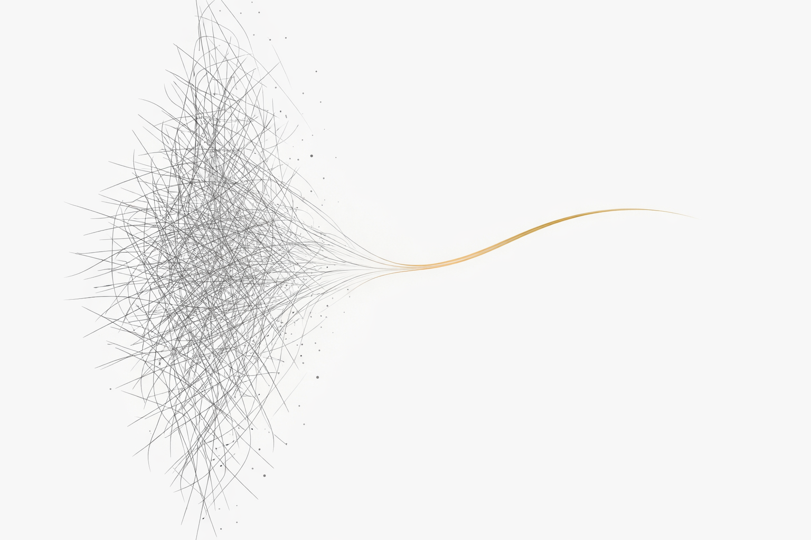

# Advertising, Redesigned

**広告は「割り込み」から「優しい提案」に変われるか —— AI時代の広告の未来を、7社の戦略と構造分析から描くOSS書籍**

  

---

## 📖 概要

僕たちは広告を嫌っている。これは感情的な話ではない。構造的な事実だ。

過去25年間、デジタル広告は「ユーザーの目的と広告主の目的が根本的に対立する」という構造の上に成り立ってきた。その結果、「広告を消すためにお金を払う」という歪んだ価値交換が常態化し、iOSユーザーの75%がトラッキングをオプトアウトし、AI検索結果内の広告が信頼を低下させると63%の米国成人が回答している。

しかし2026年、AI時代の到来がこの構造を根本から揺さぶっている。

Google、OpenAI、Anthropic、Perplexity、Meta、Microsoft、Amazon —— 7社が「AIと広告」に対して真逆の答えを出した。広告を導入する者、拒絶する者、試みて撤退した者。同じ問いに対して、世界で最も賢い人々が全く異なる戦略を選択している。

**本書は、この分断の構造を解剖し、「広告を入れるべきか否か」という二項対立を超え、「広告をユーザーが歓迎する存在に再設計できるか」という問いに到達するまでの旅路を描く。**

---

## 🏗️ 構成

本書は全9章で構成される。

| 章 | タイトル | 内容 |
|---|---|---|
| 第1章 | 広告の原罪 — なぜ僕たちは広告を嫌うのか | 25年間の「割り込み」構造、サブスクリプションという歪んだ価値交換、広告ブロッカーの「静かな反乱」。そして広告が死なない構造的理由 |
| 第2章 | 検索の終わり、対話の始まり — 構造変化の正体 | キーワード検索から対話型意思決定エンジンへ。GoogleのAI広告二層構造、DeepMindからの内部警告、「What」から「Why」への転換 |
| 第3章 | 7社の選択 — 広告導入派と広告拒否派の二極化 | OpenAIの転向、Anthropicの明確な拒否、Perplexityの撤退、Meta・Microsoft・Amazonの3社3様。7社のポジショニングマトリクス |
| 第4章 | 信頼のパラドックス — 透明にするほど信頼が下がる | Perplexityが教えた不都合な真実。「すべてを疑い始める」の構造分析。Anthropicが証明した「不在の価値」 |
| 第5章 | 「提案」としての広告は成立するか — 5つの条件 | バリュー・エクスチェンジの設計原則、Google Direct Offers、Microsoft Copilotの実証データ（CTR +73%）、Sam Altmanの転向の経済的背景 |
| 第6章 | Personal Intelligence — 究極のパーソナライゼーションとプライバシーの境界 | 「あなたより、あなたを知っている」AIの衝撃。Googleのガードレール設計、Metaの「オプトアウト不可」、EU AI Act第50条 |
| 第7章 | エージェンティック・コマース — AIが買い物を完結する未来 | Universal Commerce Protocol (UCP)、エージェンティック・チェックアウト、広告の「見せる→実行する」への進化、ディスインターメディエーションのリスク |
| 第8章 | SEOの終焉 — 確率論的可視性の時代 | SparkToro/Gumshoe.aiの衝撃的実験、Google新特許US12536233B1、WebMCP、「引用燃料」としてのコンテンツ最適化、Wayfairの実践 |
| 第9章 | 広告を入れても信頼を維持できる設計は可能か — 結論 | 4変数の複合方程式、2030年の3つのシナリオ、「広告を入れるか否か」から「歓迎される存在に再設計できるか」への問いの転換 |

---

## 📄 ドキュメント

| ファイル | 言語 | 内容 |
|---|---|---|
| [advertising_redesigned_jp.md](./docs/jp/advertising_redesigned_jp.md) | 🇯🇵 日本語 | 本文（日本語版） |
| [advertising_redesigned_en.md](./docs/en/advertising_redesigned_en.md) | 🇺🇸 English | 本文（英語版） |

---

## 🔗 Related Projects

本書は、以下のOSSプロジェクトと相互に接続されている。

| プロジェクト | 概要 | リンク |
|---|---|---|
| **The AI Strategist** | AIストラテジストという職業を定義し、BTC交差点で戦うための実践的フレームワーク | [GitHub](https://github.com/Leading-AI-IO/the-ai-strategist) |
| **Depth & Velocity** | 生成AI時代の新規事業開発方法論 | [GitHub](https://github.com/Leading-AI-IO/depth-and-velocity) |
| **The Redesign of Design Strategy** | デザイン戦略の再定義。IDEO崩壊の構造分析を含む | [GitHub](https://github.com/Leading-AI-IO/design-strategy-in-the-ai-era) |
| **The Palantir Impact** | Palantir Foundryのオントロジー戦略を解剖。産業構造の解剖シリーズ第1弾 | [GitHub](https://github.com/Leading-AI-IO/palantir-ontology-strategy) |
| **The Silence of Intelligence** | Anthropic CEO ダリオ・アモディの思想を体系化。産業構造の解剖シリーズ第2弾 | [GitHub](https://github.com/Leading-AI-IO/the-silence-of-intelligence) |
| **The Orchestrator** | AI時代に最も希少な人材像「オーケストレーター」を世界で初めて定義 | [GitHub](https://github.com/Leading-AI-IO/the-orchestrator-in-the-ai-era) |
| **What They Won't Teach You** | AIに有利な世代が教えない、AIの使い方と"思考のOS" | [GitHub](https://github.com/Leading-AI-IO/what-they-wont-teach-you) |
| **The Edge of Intelligence** | AIがあなたのデバイスで動く時代：クラウドの終わりと、エッジの始まり | [GitHub](https://github.com/Leading-AI-IO/edge-ai-intelligence) |
| **The Anatomy of Anthropic** | Anthropicの戦略・製品・研究・安全性を包括的に解剖 | [GitHub](https://github.com/Leading-AI-IO/the-anatomy-of-anthropic) |

---

## 👤 著者

**Satoshi Yamauchi** (山内 怜史)
* **AI Strategist & Business Designer at Sun Asterisk Inc.**
* **Founder / AI Strategist at Leading.AI**
* 15年以上にわたりBusiness・Technology・Creativeの3領域を越境。フューチャーアーキテクトでITコンサルタントとして40案件のPL/PMを推進後、リクルートで事業戦略・新規事業開発に従事。Sun Asteriskでビジネスデザイナー兼AIストラテジストとして、新規事業×生成AIの方法論「Depth & Velocity」を体系化。

* This project is part of the research by Leading.AI.
  
* [📒 Read my insights on Note](https://note.com/satoshi_yamauchi) 
* [🌐 Visit Leading.AI Official Website](https://www.leading-ai.io/)

---

## 🤝 Contributing

Issues and Pull Requests are welcome. AI広告の各国規制動向の追加、新たな事例やデータの補足、誤字脱字の修正など、皆様からのContributeを歓迎します。

---

## 📝 License

This work is licensed under a [Creative Commons Attribution 4.0 International License](https://creativecommons.org/licenses/by/4.0/). 
© 2026 Satoshi Yamauchi / Leading AI — Licensed under CC BY 4.0
