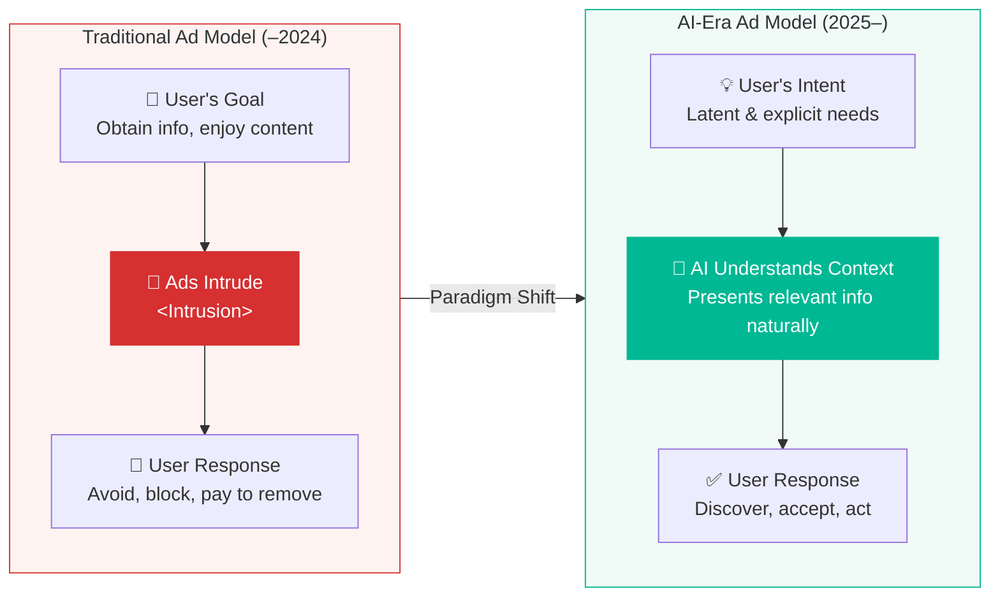
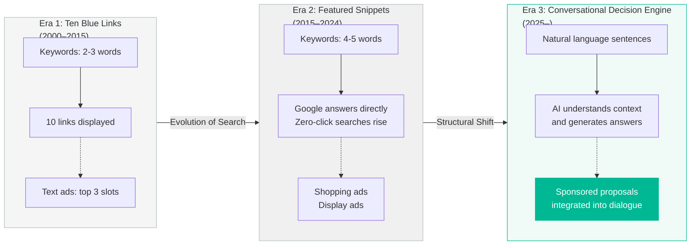
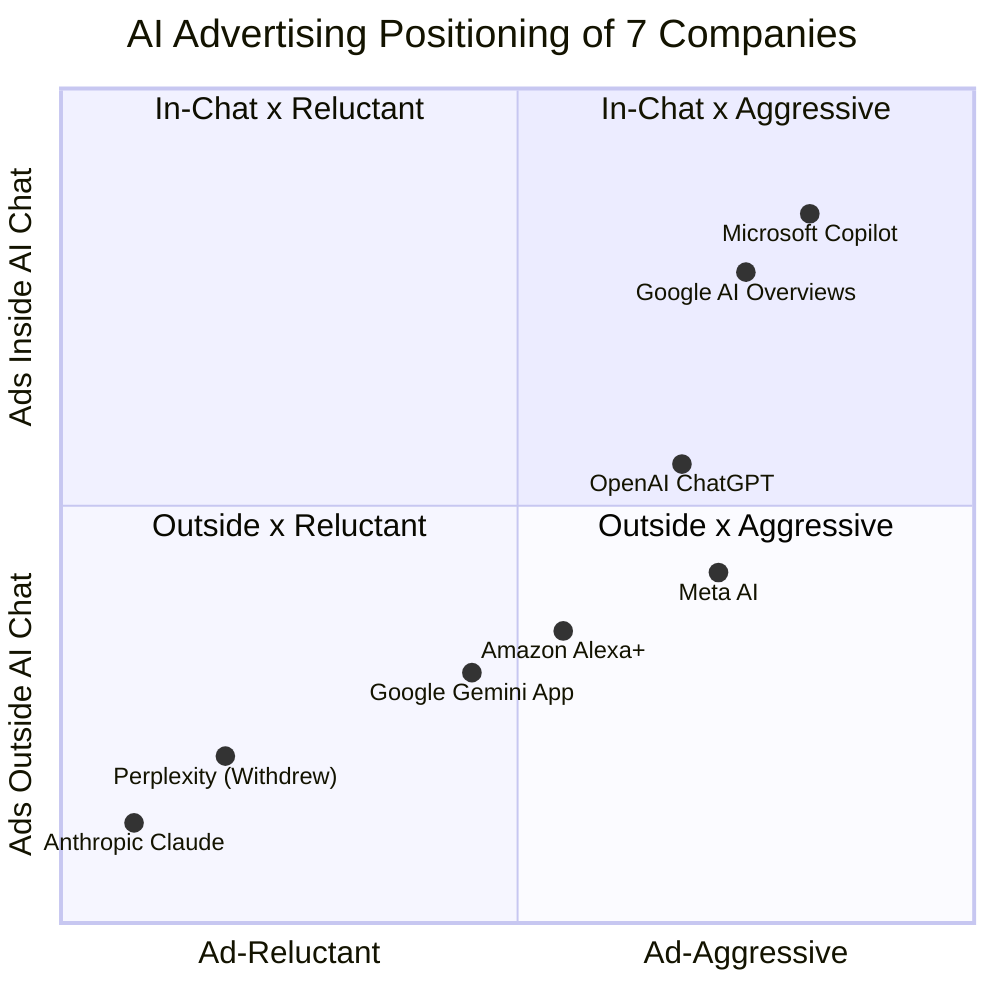
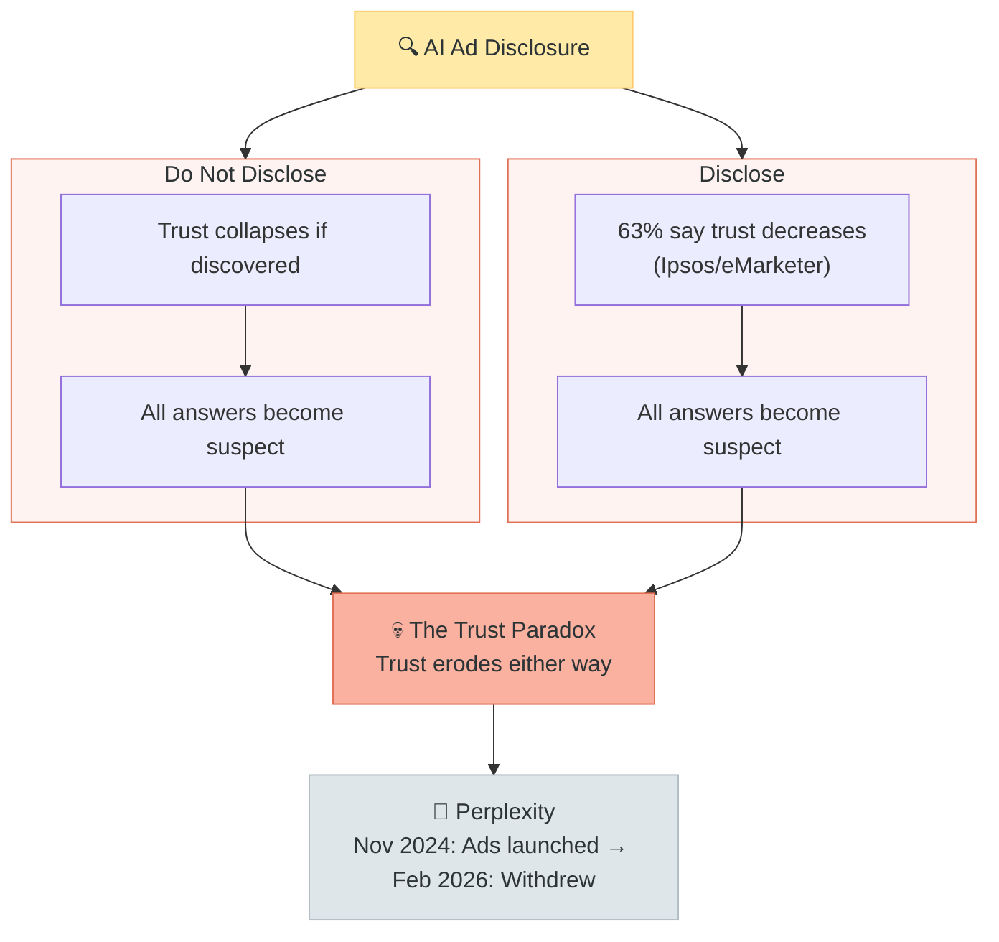
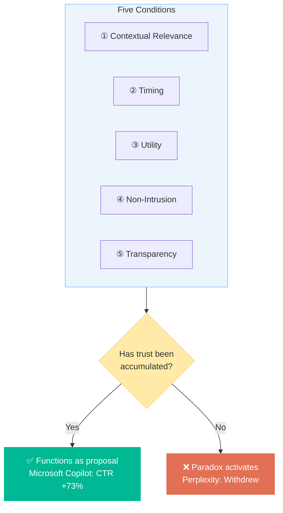
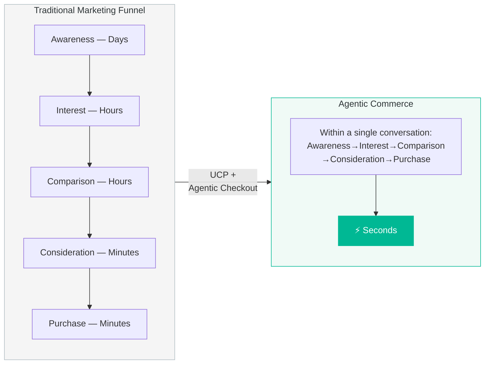
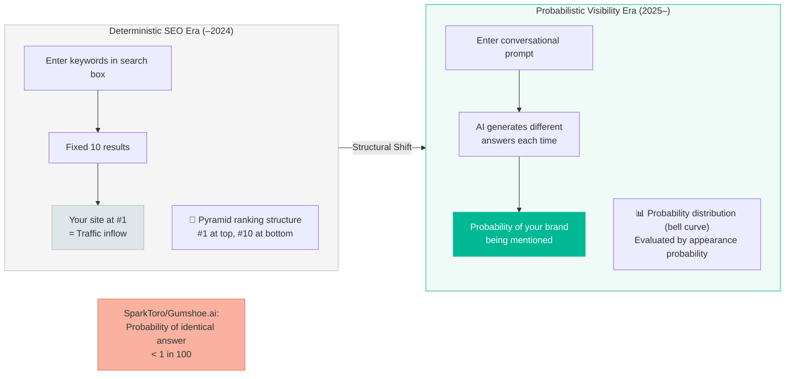
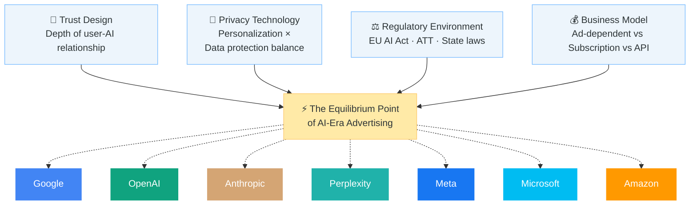

# Advertising, Redesigned

AI will transform advertising from intrusion to a gentle, welcome proposal. The end of search, agentic commerce, and the trust paradox — an open-source book envisioning a future where advertising becomes something users actually welcome.

  

 

## Chapter 1: The Original Sin of Advertising — Why We Hate Ads

### 1.1 Twenty-Five Years of Intrusion — The Structural Flaw of Digital Advertising

We hate ads.

This is not an emotional statement. It is a structural fact. For a quarter of a century, the mechanics of digital advertising have depended on a traffic-driven model: how to place ads between pieces of content, capture user attention, and induce clicks.

When we read a web page, watch a video, or open a news app — our original intent is to obtain information, enjoy content, or make a decision. Against all of these, advertising has always been an **intrusion**.

Banner ads fill every margin of the page. A 15-second commercial interrupts the video. A pop-up covers the article mid-read. Every third post in our social feeds is an ad.

These all share one structural reality: **the user's goal and the advertiser's goal are fundamentally in conflict.**

Users want information. Advertisers want attention. This structural conflict has spent 25 years embedding the subconscious perception that "ads = annoyance."

### 1.2 Paying to Remove Ads — A Distorted Value Exchange

This structural conflict has produced one profoundly symbolic phenomenon: **the subscription model.**

YouTube Premium, Spotify Premium, Netflix, NewsPicks Premium. The message common to all these services is: "Pay, and the ads disappear."

Consider this structure carefully. We are **not paying to gain something. We are paying to eliminate something.** We recognize a value of $8–15 per month in silencing the "noise" of advertising. This is a profoundly distorted value exchange.

If advertising were genuinely "valuable information," there would be no need to remove it. Nobody says "that restaurant menu is annoying — get rid of it." Nobody thinks "I don't want to read these travel recommendations because they're ads." Those are information that helps us make decisions.

Digital advertising is not hated because it is advertising. It is hated because **we are shown things we don't want, at times we don't choose, in quantities we didn't ask for — all at the advertiser's convenience.**

### 1.3 Ad Blockers — The Quiet Rebellion

User frustration is also visible in the data.

| Metric | Value | Source |
|---|---|---|
| iOS users who opt out of tracking | 75% | Apple ATT (App Tracking Transparency) |
| U.S. adults saying AI search ads reduce trust | 63% | Ipsos / eMarketer |
| Respondents rating explicit AI-generated labeling as "very important" | 78% | Gartner (October 2025 survey) |

The fact that 75% of iOS users have opted out of tracking is not merely a rise in privacy awareness. It is a clear declaration: "I will not allow my behavioral data to be used to optimize ads for me."

Ad blocker adoption rates, cookie rejection rates, premium plan subscriptions — they all convey the same message: **"Enough is enough."**

### 1.4 Yet Advertising Will Not Die — The Structural Reason

Here is an important question: **If advertising is this hated, why doesn't it disappear?**

The answer is simple. Advertising is the oxygen of the internet economy.

| Platform | Annual Ad Revenue | Ad Share of Total Revenue | Source |
|---|---|---|---|
| Google Search (related) | $224.5B (2025) | Over 97% | Alphabet Earnings |
| Meta (Facebook/Instagram) | ~$210B (2025) | 97% | Meta Earnings |
| Amazon Advertising | $56B (2024) | Growth rate +20%+ | Amazon Earnings |
| Microsoft Advertising | $20B+ | — | Microsoft Earnings |

Google's annual ad revenue: $224.5 billion. This figure equals roughly 5% of Japan's GDP. Combined with Meta, Amazon, and Microsoft, advertising alone creates an economic zone exceeding $500 billion.

It is precisely because this massive economic engine keeps running that we can use Google Search for free, Gmail for free, watch YouTube for free. Instagram, Facebook, TikTok — all free.

**Advertising is hated. But without advertising, the internet as we know it would not exist.** This is the original sin of advertising, and its structural contradiction.

### 1.5 Reframing the Question — From "Eliminating Ads" to "Redesigning Ads"

Given the discussion so far, the question we should be asking is not "Can we get rid of ads?"

It is: **"Can we transform ads into something that isn't hated?"**

What if advertising presented only relevant information, in a natural form, precisely at the moment when we latently or explicitly think "I want this"?

Wouldn't that be received not as a hard sell, but as a helpful proposal?

Vidhya Srinivasan, VP/GM of Ads & Commerce at Google, said this at Google Marketing Live in May 2025:

> **"Ads aren't about interrupting — they're about helping customers discover products and services."**

She continued: "Even in searches without explicit purchase intent, AI can understand when connecting a user to a product or business is the most beneficial next step. In many cases, that connection is an ad."

The world her words describe is fundamentally different from today's advertising.

And the technology that made that world possible is AI — the emergence of large language models.

---

**[Figure 1: The Structural Shift in the Advertising Paradigm]**

---

This book examines that question structurally across nine chapters. How will advertising change in the AI era? What choices have seven major platforms made? Can "advertising as proposal" truly work? And what lies beyond?

From the original sin of advertising to its redesign.

Let us begin the journey.

 

## Chapter 2: The End of Search, the Beginning of Conversation — The True Nature of Structural Change

### 2.1 The Age of Keywords Is Ending

Between 2025 and 2026, the relationship between humans and information changed at its foundation.

For the past 20 years, the way we obtained information was "type keywords." "Tokyo lunch recommendations," "MacBook Pro specs comparison," "how to file taxes." We threw fragmented words into a search box and opened whichever of the ten blue links seemed most relevant.

This behavior is fundamentally changing.

The data proves it. Queries of five or more words are growing **1.5x faster** than shorter searches. Early testers of Google AI Mode are entering queries **2–3x longer** than traditional searches.

Users no longer type fragmented keywords. They type:

- "How to keep a suit wrinkle-free on a long flight"
- "Easy-care modern rug suitable for a high-traffic dining room"
- "Hot spring trip within 2 hours of Tokyo for a family with a 5-year-old, next weekend"

This is not **search**. This is **conversation**.

### 2.2 The Emergence of the "Conversational Decision Engine"

Search behavior has evolved from simple information discovery to a **Conversational Decision Engine** — AI that deeply understands context.

Let's see the scale of this change in numbers.

| Metric | Value | Period | Source |
|---|---|---|---|
| Google AI Overviews reach | 2B+ users/month, 200 countries | End of 2025 | Alphabet Earnings |
| Gemini app MAU | 750M | End of 2025 | Google |
| ChatGPT WAU | 900M+ | Early 2026 | OpenAI |
| Alphabet total annual revenue | $402.8B (first-ever $400B+) | FY2025 | Alphabet Earnings |
| Google Search-related ad revenue | $224.5B (+13.4% YoY) | FY2025 | Alphabet Earnings |

The Gemini app exploded from 9 million MAU in early 2024 to **750 million** by the end of 2025. An 83x increase in under two years — one of the fastest product growth curves in human history.

### 2.3 Search Engines Become a "Transaction Layer"

Traditional search engines were "neutral gateways that route traffic to publishers' sites." Users searched, clicked links, and navigated to sites. The search engine's role was intermediation.

Now, search engines are transforming into **commercial transaction layers that complete transactions within their own environment.**

Google's AI Overviews already contain all the information within the answer itself. Users don't need to click links. The answer appears directly atop the search results page.

What does this mean?

**When AI Overviews appear, clicks to websites drop by 34.5%.** Meanwhile, traffic from AI assistants converts at **4.4x** the rate — a striking paradox.

In other words, outbound clicks from search results decrease, but purchase behavior within the search environment increases dramatically. The search engine is shifting from "gateway" to "marketplace."

### 2.4 Google's AI Ad Strategy — Reading the Dual-Layer Structure

To accurately understand Google's ad strategy, you need to recognize that they are **deliberately operating a dual-layer structure.**

**Layer 1: AI Overviews / AI Mode — Aggressively expanding ads**

Ad integration into AI Overviews launched in October 2024 on U.S. mobile. Ads are labeled "Sponsored" and appear above, below, and within AI-generated answers. CBO Philipp Schindler stated in the Q1 2025 earnings call that "AI Overviews are monetizing at **roughly the same rate** as traditional search."

**Layer 2: Gemini App — No ads (but not ruling them out)**

CEO Sundar Pichai said in February 2025 that he has "**very good ideas** about native ad concepts" but would "let the user experience lead." Meanwhile, VP of Ads Dan Taylor has repeatedly stated "there are no ads in the Gemini app, and we have no plans to change that."

However, in December 2025, Adweek reported that "Google has told at least two advertisers that ads will come to Gemini in 2026."

What does this temperature gap mean? **Google is calibrating the optimal timing and format for introducing ads to the Gemini app.** Build the massive base of 750M MAU first, then introduce ads. Just as they did with YouTube.

### 2.5 The Warning from Google DeepMind — An Internal Crack

There is a statement that should not be overlooked.

Google DeepMind co-founder **Demis Hassabis** said in early 2026:

> **"Whether ads are a good fit for a deeply personal AI assistant is questionable — recommendations need to be unbiased and genuinely helpful."**

He further warned that "poor execution would quickly erode user trust."

Even within Google, cautious debate continues about the timing and methods for ad integration. Even the champion of AI search acknowledges the danger of "putting ads inside a conversation."

This tension runs through the entire book. **What is technically possible and what users will accept are not the same thing.**

### 2.6 The Shift from "What" to "Why" — The Question Confronting Marketers

This structural change confronts advertisers and marketers with a fundamental question.

| Dimension | Traditional Digital Ads (–2024) | AI-Native Ads (2025–) |
|---|---|---|
| Underlying paradigm | Attention capture via Intrusion | Problem-solving support via Proposal |
| Primary intent signal | Fragmented keywords, click history, demographics | Conversational context, layered needs, long prompts |
| Nature of UX | Temporary disruption of content flow | Solution presented as natural extension of dialogue |
| Platform role | Neutral routing between advertisers and users | System that interprets intent and integrates commercial options within dialogue |
| Marketer's question | **What** is the user searching for? | **Why** is the user searching? |

Where traditional search ads depended on the one-dimensional signal of "search keywords," conversational queries in AI Mode provide extremely high-resolution intent signals that include context, background, and constraints.

Whether marketers can infer "Why" from "What" and present solutions accordingly — this is the dividing line between survival and irrelevance in AI-era advertising.

---

**[Figure 2: The Structural Transformation of Search Behavior]**

---

Search itself has changed. And that change cannot help but reshape advertising from its foundations.

In the next chapter, we examine how the world's leading AI companies have responded to this shift. What emerges is not a simple binary of "include ads or don't" — it is a far more complex, far more fundamental divide.

 

## Chapter 3: Seven Companies, Seven Choices — The Polarization of Ad Adopters and Ad Rejectors

### 3.1 February 2026: The Divide Became Visible

February 2026. In the history of the AI industry, this month will be remembered as the month the advertising divide surfaced.

On February 9, OpenAI deployed ads in the free version of ChatGPT.
On the same weekend of February 8–9, Anthropic aired a Super Bowl LX commercial declaring "Ads are coming to AI. But not to Claude."
In mid-February, Perplexity terminated its ad program entirely.

That all three events occurred in the same month was no coincidence. The battle lines over AI-era advertising could no longer be contained beneath the surface.

This chapter examines Google, OpenAI, Anthropic, Perplexity, Meta, Microsoft, and Amazon — dissecting each company's choice and the structural reasons behind it.

### 3.2 OpenAI: From "Ads Are a Last Resort" to "For the Benefit of Humanity"

OpenAI's evolving stance on advertising is one of the most dramatic reversals in AI advertising history.

**May 2024, at Harvard University.**

Sam Altman said:

> **"The combination of ads and AI feels uniquely unsettling. Advertising is a last resort for our business model."**

He also stated personally that he "hates ads."

Yet during the same period, OpenAI was quietly preparing for advertising internally.

| Person | Previous Role | OpenAI Role | Joined |
|---|---|---|---|
| Shivakumar Venkataraman | Led Google Search ads for 21 years | VP | May 2024 |
| Kevin Weil | Built Instagram's ad platform | Chief Product Officer | 2024 |
| Fidji Simo | Launched Facebook News Feed ads | CEO of Applications | 2024 |

While claiming to hate ads, OpenAI simultaneously hired the top ad executives from Google, Meta, and Instagram. This contradiction should not be overlooked.

**January 16, 2026: OpenAI officially announced ad testing for ChatGPT.**

**February 9: Ads went live in the U.S.**

| Item | Details |
|---|---|
| Ad-visible tiers | Free and Go ($8/month) |
| Ad-free tiers | Plus ($20/mo), Pro ($200/mo), Business, Enterprise, Education |
| Ad format | Text, "Sponsored" label below answers |
| Targeting | Conversation topics, past chat content, prior ad interactions |
| CPM | ~$60 |
| Minimum spend | $200,000 |
| Excluded | Users under 18; sensitive topics (health, mental health, politics) |

CFO Sarah Friar justified the move at Davos in January 2026:

> **"Our mission is to realize AGI for all of humanity — not just for those who can afford to pay."**

And on February 9, Altman himself posted on X:

> **"It is clear to us that a lot of people want to use a lot of AI and don't want to pay."**

OpenAI's structural rationale is clear. Of its 900M+ weekly active users, roughly 95% are on free or Go tiers. The company is projected to burn approximately $8 billion in 2025 and an estimated $17 billion in 2026. ARR stands at roughly $25 billion, but Deutsche Bank projects cumulative losses could reach $143 billion before breakeven.

**Advertising was not a "last resort" — it was a structural necessity for survival.**

### 3.3 Anthropic: "Claude Is a Space to Think" — An Unequivocal Refusal

On February 4, 2026, Anthropic published a declaration on its official blog:

> **"Claude is a space to think."**

The core of this declaration can be distilled into five points:

**First**: "There are plenty of places where ads belong. Conversations with Claude are not one of them."

**Second**: Users should never have to wonder whether AI is genuinely helping them or subtly steering the conversation toward something monetizable.

**Third**: A significant portion of Claude conversations involve sensitive and deeply personal topics, making ads "inappropriate."

**Fourth**: Ads create incentives to optimize for engagement (time spent), but the most useful AI interaction may be a short answer.

**Fifth**: Advertising incentives tend to expand over time, blurring boundaries that were once clear.

Then, during Super Bowl LX on February 8–9, Anthropic aired the AI industry's first-ever Super Bowl commercials.

Four ads ("Treachery," "Deception," "Violation," "Betrayal") humorously depicted a chatbot reminiscent of ChatGPT showing inappropriate ads mid-conversation, with the tagline:

> **"Ads are coming to AI. But not to Claude."**

The results were striking.

| Metric | Result |
|---|---|
| Daily active users | **+11% increase** |
| Site visits | **+6.5% increase** |
| App Store ranking | Entered Top 10 Free Apps |

Marketing scholar Scott Galloway called it a **"seminal moment,"** comparing it to Apple's legendary 1984 Super Bowl commercial.

**The market proved that the absence of ads can itself be a powerful competitive advantage.**

Anthropic's revenue structure is fundamentally different from OpenAI's. 70–75% comes from API revenue (primarily enterprise and developer clients), with the remainder from consumer subscriptions. In the coding domain, Anthropic leads with 42% market share (versus OpenAI's 21%). It has a business model that can sustain itself without advertising.

### 3.4 Perplexity: The Pioneer That Tried and Retreated

Perplexity's case is the most vivid illustration of the gap between the ideal and reality of AI advertising.

**November 2024**: Launched "Sponsored Questions" in the U.S. After AI generated an answer to a user's query, sponsored questions appeared in the "Related Questions" section — an innovative format. CPM exceeded $50 (roughly 20x the industry average).

**Result**: Total ad revenue for all of 2024 was approximately **$20,000**. That's 0.06% of $34 million in total revenue.

**August 2025**: Head of ad sales Taz Patel departed.

**October 2025**: Stopped accepting new advertisers.

**February 2026**: **Completely terminated** the ad program.

An executive stated:

> **"A user starts doubting everything — that's the challenge with ads."**

This single statement encapsulates the fundamental challenge of AI advertising. In conversational AI, users receive the AI's answers as "trustworthy information." The moment advertising enters that trusted space, **every answer becomes suspect: "Is this a genuine recommendation, or is it an ad?"** Once trust breaks, it cannot be restored.

### 3.5 Meta, Microsoft, Amazon: Three Distinct Approaches

#### Meta: "Using AI as Fuel for Ad Targeting"

Meta made the most aggressive choice. From December 2025, conversation content from Meta AI interactions on WhatsApp, Instagram, and Facebook has been directly used for ad personalization. The target: approximately 1 billion monthly Meta AI users. **No opt-out** (except in the EU, UK, and South Korea).

Ads do not appear directly within Meta AI's responses. However, conversation data from Meta AI interactions feeds targeting signals across Meta's entire ad ecosystem. Mark Zuckerberg described a fully automated vision: "Tell us your goal, connect your bank account, and you won't need creatives or targeting."

#### Microsoft Copilot: "Most Advanced in In-Conversation AI Ads"

Microsoft is pushing AI conversation ads most aggressively. Copilot displays "Sponsored" ad blocks below answers and even features an "ad voice" function where the AI explains why it included the ad.

The results are remarkable.

| Metric | vs. Traditional Search Ads |
|---|---|
| Click-through rate | **+73%** |
| Conversion rate | **+16%** |
| Purchase journey | **33% shorter** |

#### Amazon: "Uncharted Territory of Voice AI Ads"

Amazon has stated that "there is an opportunity for ads to help people discover things within multi-turn conversations" (Andy Jassy) and is laying groundwork for voice AI advertising. However, Alexa+ does not yet include in-conversation ads.

Expert opinion is divided. Optimists say "Alexa is like an influencer — you could sell ad reads at a high premium, like live radio podcasts." Skeptics warn: **"If an invited guest turns into a salesman, they'll be shown the door."**

### 3.6 The Positioning Matrix of Seven Companies

| Platform | Ad Stance | In-Conversation AI Ads | Primary Revenue Model | MAU/WAU |
|---|---|---|---|---|
| Google (AI Overviews/AI Mode) | Actively expanding | Yes (Sponsored) | Ads (97%+) | 2B |
| Google (Gemini App) | Denied (future hinted) | None | Subscription-focused | 750M |
| OpenAI (ChatGPT) | Launched Feb 2026 | Yes (Free/Go only) | Subscription + Ads + API | 900M WAU |
| Anthropic (Claude) | Explicitly refused | None | API (70-75%) + Subscription | ~19M MAU |
| Perplexity | Withdrew (Feb 2026) | None (withdrawn) | Subscription | ~22M MAU |
| Meta AI | Indirect (targeting use) | None (data utilized) | Ads (97%) | 1B |
| Microsoft Copilot | Most advanced | Yes (multiple formats) | Ads + Subscription | 140M DAU |
| Amazon Alexa+ | Planning stage | None (future planned) | Commerce + Subscription | 500M+ devices |

---

**[Figure 3: Positioning Map of Seven Companies]**

---

Looking across these seven choices, one question emerges.

Perplexity introduced ads and retreated. Anthropic refused ads and saw DAU increase 11%. Microsoft saw CTR improve 73%.

**In the same "AI × Advertising" space, why do outcomes diverge so dramatically?**

The answer lies in the "Trust Paradox" we unravel in the next chapter.

 

## Chapter 4: The Trust Paradox — More Transparency, Less Trust

### 4.1 The Inconvenient Truth Perplexity Taught Us

As we saw in Chapter 3, Perplexity introduced AI ads in November 2024 and fully withdrew by February 2026.

This withdrawal is the most important case study in AI advertising history. Because Perplexity's ad format was **the most technically sophisticated** of any.

Here is how it worked: a user asked a question, the AI generated an answer, and then a "Sponsored" question appeared in the "Related Questions" section. This question itself was AI-generated — not written directly by the advertiser. In other words, it was an ad that naturally presented itself as a relevant "next question" for the user.

The closest design to the ideal of "advertising as proposal." Yet the results were dismal.

| Metric | Value |
|---|---|
| Total ad revenue (all of 2024) | **~$20,000** |
| Ad share of total revenue | **0.06%** (of $34M) |
| Media buyer assessment | "Too small, insufficient ROI data" (6 agencies) |
| Head of ad sales | Departed August 2025 |
| New advertiser intake | Stopped October 2025 |
| Ad program | **Fully terminated February 2026** |

The executive's words upon withdrawal say it all:

> **"A user starts doubting everything — that's the challenge with ads."**

### 4.2 The Structure of "Doubting Everything"

This statement exposes a **structural trap** of advertising in conversational AI.

In traditional web search, ads and organic results were visually separated. The top three slots were labeled "Ad"; below them, organic results. Users intuitively understood "top = ads, below = search results." The boundary of trust was clear.

In conversational AI, that boundary dissolves.

AI-generated responses are a single continuous text. The moment "Sponsored" information is mixed in, user doubt **spills over to the unlabeled portions as well.**

"Is this answer really what the AI determined was optimal? Or is it recommending this because the advertiser paid?"

Once this doubt arises, **every answer is contaminated.** Not just the ones with ads — even the ones without. This is the true meaning of the executive's "doubting everything."

### 4.3 Data Proves the Trust Paradox

This structural problem is not a matter of perception. It is proven by data.

| Study | Finding | Source |
|---|---|---|
| Do AI search ads reduce trust? | **63%** of U.S. adults say yes | Ipsos / eMarketer |
| Importance of explicit AI-generated labeling | **78%** rate it "very important" or "most critical" | Gartner (October 2025) |
| Effect of AI-use disclosure on trust | Disclosure **reduces** trust | Taylor & Francis experimental study (N=304, 2025) |

The third data point is the most shocking.

A 2025 experimental study published by Taylor & Francis (304 participants) confirmed that **disclosing the use of AI actually decreases trust.**

In other words:

- **Conceal** that it's an ad → If discovered, trust collapses
- **Disclose** that it's an ad → At the point of disclosure, trust declines

**Whether you conceal or disclose, trust decreases.** This is the Trust Paradox.

### 4.4 Deconstructing the Paradox

Why does this paradox arise? Structurally deconstructed, there are three layers.

#### Layer 1: The Expectation Gap

Users' expectation of an AI assistant is "a neutral entity that provides optimal information." With Google Search, there was an implicit understanding that "ads are mixed in." But with AI assistants, that understanding has not yet been established.

Users perceive AI not as "a search engine with ads" but as "a trusted advisor." When that advisor shows an ad, it is received as **betrayal.**

#### Layer 2: The Intimacy of Conversation

As Anthropic noted, AI conversations often involve "sensitive and deeply personal topics." Health concerns, career advice, family issues. The discomfort of ads being inserted into such intimate dialogue is categorically different from a banner ad on a webpage.

Imagine confiding a personal worry to a trusted friend, and mid-conversation they suddenly say "You should buy this product." Then you learn that friend was paid by the product's manufacturer. You would never confide in that friend again.

#### Layer 3: Unverifiability

In web search, you could skip ads and check organic results. You could compare multiple sources and verify credibility yourself.

But AI responses are presented as a single integrated text. There is no way for users to verify which parts were influenced by advertising and which were not. This **unverifiability** amplifies distrust.

---

**[Figure 4: The Structure of the Trust Paradox]**

---

### 4.5 The Value of Absence — Proven by Anthropic

Anthropic's answer to the Trust Paradox was to **refuse to solve it.**

To the question "Can you introduce ads and still maintain trust?" Anthropic answered: "Don't introduce ads." And it **proactively declared** that choice.

The Super Bowl commercial results, restated:

| Metric | Result |
|---|---|
| Daily active users | **+11% increase** |
| Site visits | **+6.5% increase** |
| App Store ranking | Entered Top 10 Free Apps |

By advertising the very absence of ads, Anthropic **stood outside the Trust Paradox entirely.** No need to agonize over disclosure or concealment — because ads simply don't exist.

Altman pushed back: "Anthropic sells expensive products to wealthy people. We need to deliver AI to the billions who can't afford a subscription."

This counterargument has structural legitimacy. Anthropic's model **depends on API revenue (70–75%)** and lacks the economic foundation to deploy a free consumer tier at scale. The choice to "not include ads" is not just a noble philosophy — it is also a structural consequence of the business model.

But regardless of the reason, the result is clear. **The market recognized value in the absence of ads.** The DAU +11% number proves it.

### 4.6 Can the Paradox Be Solved?

Three positions exist regarding the Trust Paradox.

**Position A: The paradox can be solved (Google, Microsoft)**

Through improved technical precision and value-exchange design, it is possible to create a state where users accept ads as "useful proposals." Microsoft's data (CTR +73%, CVR +16%) supports this position.

**Position B: The paradox cannot be solved (Anthropic, post-withdrawal Perplexity)**

Advertising in conversational AI structurally damages trust and should not be introduced. Perplexity's withdrawal and Anthropic's DAU +11% support this position.

**Position C: The paradox cannot be solved "yet" (Google Gemini App, Amazon)**

Technically possible, but user acceptance is not ready; wait for the right timing. Pichai's statement — "We have very good ideas, but we'll let the user experience lead" — embodies this position.

Which position is correct depends on whether the "five conditions" examined in the next chapter can be satisfied.

 

## Chapter 5: Can Advertising Work as "Proposal"? — Five Conditions

### 5.1 The Design Principles of Value Exchange

Against the Trust Paradox presented in Chapter 4, one camp argues "ads can be introduced while maintaining trust." Google, Microsoft, OpenAI.

To structurally verify their claim, we must clarify the conditions under which "advertising as proposal" can succeed.

For a user to perceive an ad not as "an annoyance" but as "a useful proposal," the following **five conditions must be met simultaneously.**

| # | Condition | Definition | Current Implementation Example |
|---|---|---|---|
| ① | Contextual Relevance | Ad content precisely matches the user's current context and intent | Google AI Overviews: Ads linked to AI-generated answer context |
| ② | Timing | Presented at the moment the user is ready to receive information about that topic | Microsoft Copilot: Ads shown after user explores options in dialogue |
| ③ | Utility | Provides information the user cannot easily find on their own | Google Direct Offers: Real-time inventory, pricing, and purchase links |
| ④ | Non-Intrusion | Does not interrupt or obstruct the user's primary task | OpenAI: Text ads placed below answers, visually separated |
| ⑤ | Transparency | Clearly labeled as advertising; no disguise of commercial intent | All platforms: "Sponsored" labeling |

### 5.2 Google "Direct Offers" — An Implementation of the Five Conditions

Google's most aggressive attempt to implement the five conditions is the "Direct Offers" format being piloted in AI Mode.

This format presents a user's query directly with matching product information: real-time inventory, current pricing, product images, customer reviews, and purchase links — all integrated within the AI-generated answer.

When a user asks "What's a good ergonomic chair for someone who sits 10+ hours a day?" the AI generates an answer, and within it presents three product options with pricing, availability, and links. No need to open another page — the transaction can be completed within the dialogue.

### 5.3 Microsoft Copilot's Data — Evidence That "Proposal" Works

Microsoft Copilot's data provides the strongest evidence that "advertising as proposal" can function.

| Metric | vs. Traditional Search Ads |
|---|---|
| Click-through rate | **+73%** |
| Conversion rate | **+16%** |
| Purchase journey | **33% shorter** |

These numbers carry significant implications. CTR +73% means that the ad content Microsoft Copilot presents is far more likely to be perceived as "useful information" than traditional search ads.

CVR +16% means users who click on the ad ultimately purchase at a higher rate. The information was not merely relevant — it was **useful for decision-making.**

The 33% shorter purchase journey means fewer detours between ad exposure and purchase. The funnel is being compressed.

### 5.4 Google's Philosophy — "Not Interrupting but Helping Discover"

Vidhya Srinivasan's words at Google Marketing Live 2025 bear repeating:

> **"Ads aren't about interrupting — they're about helping customers discover products and services."**

This philosophy is the conceptual foundation supporting the five conditions. And Google has attempted to technically implement this philosophy through "Text Guidelines."

Text Guidelines is a framework that shares the advertiser's brand tone, product details, and compliance requirements with Google's AI, letting the AI automatically generate optimal ad text. The advertiser provides only the "ingredients"; the AI handles the "cooking."

This approach structurally differs from traditional digital advertising: instead of advertisers directly creating ad copy, the AI generates text that naturally integrates with the conversational context. The result is a mechanism that eliminates the sense of "forced insertion."

### 5.5 Sam Altman's Reversal and the Economic Reality

Why did Altman, who said "ads are a last resort" and "I hate ads," reverse course just 18 months later?

The structural answer lies in the numbers.

| Metric | Value | Source |
|---|---|---|
| WAU | 900M+ (early 2026) | OpenAI |
| Free/Go tier share | ~95% | OpenAI ad launch announcement |
| 2025 projected cash burn | ~$8B | Various reports |
| 2026 projected cash burn | ~$17B (estimated) | Deutsche Bank |
| ARR | ~$25B | OpenAI |
| Projected cumulative losses before profitability | up to $143B | Deutsche Bank |

With 95% of users as non-paying or low-paying, and annual cash burn approaching $17 billion, subscriptions alone cannot sustain the business. The $200K minimum ad spend and $60 CPM that OpenAI set represent not only premium pricing but a signal of the magnitude of the revenue gap they need to fill.

This is not a story of philosophy losing to greed. It is a story of **structural economic reality forcing a strategic pivot.** Altman did not stop hating ads. He simply could not afford not to have them.

### 5.6 The Limits of Five Conditions — Trust Cannot Be Bought with Conditions

Here lies the critical caveat.

Even if all five conditions — contextual relevance, timing, utility, non-intrusion, transparency — are perfectly met, **one thing is still missing: trust.**

Microsoft Copilot's CTR +73% works because it operates in a **search context** where users implicitly accept that commercial information is mixed in. The expectations are different from the start.

Perplexity's failure occurred despite technically meeting many of the five conditions. Sponsored Questions were contextually relevant, well-timed, and transparent. But trust had not been built.

The five conditions are **necessary** conditions, not **sufficient** conditions. Without the accumulated trust that wraps around these conditions, they do not function.

---

**[Figure 5: The Five Conditions and Their Relationship to Trust]**

**Achievement comparison across the five conditions:**

| Condition | Traditional Digital Ads | AI-Era Ads (Current) | Ideal "Proposal" |
|---|:---:|:---:|:---:|
| ① Contextual Relevance | ★☆☆☆☆ | ★★★★☆ | ★★★★★ |
| ② Timing | ★★☆☆☆ | ★★★☆☆ | ★★★★★ |
| ③ Utility | ★★☆☆☆ | ★★★★☆ | ★★★★★ |
| ④ Non-Intrusion | ★☆☆☆☆ | ★★★☆☆ | ★★★★★ |
| ⑤ Transparency | ★★★☆☆ | ★★★★☆ | ★★★★★ |
| **Accumulated Trust** | **None** | **Under construction** | **Prerequisite** |

---

Technical conditions are falling into place. But trust cannot be purchased with technology.

In the next chapter, we examine Google's most ambitious project attempting to solve this trust challenge through technology — Personal Intelligence.

 

## Chapter 6: Personal Intelligence — The Boundary Between Ultimate Personalization and Privacy

### 6.1 "Knowing You Better Than You Know Yourself"

"Personal Intelligence," which Google rolled out in beta in 2026, embodies both the pinnacle and the peril of AI-era advertising.

Built on the Gemini 3 model, this feature goes beyond single-app search. It **infers data across multiple apps** — Gmail, Google Photos, YouTube, Calendar — achieving deep understanding of individual user context.

Consider this example.

A user tells Gemini: "I want to buy tires for my minivan." A conventional AI would return generic minivan tire recommendations.

Personal Intelligence is different.

1. **Google Photos**: Reads the license plate to identify the vehicle make and model
2. **Gmail**: Extracts past tire purchase history and maintenance records
3. **YouTube**: Infers lifestyle preferences (outdoor enthusiast, etc.) from viewing history
4. **Calendar**: Identifies an upcoming camping trip next month
5. Synthesizes all of the above to suggest **"all-weather tires ideal for next month's camping trip"**

The user only said "I want tires." But the AI combined the vehicle model, driving patterns, lifestyle, and schedule to infer a need the user hadn't articulated.

**It knows the user better than the user knows themselves.** That is the essence of Personal Intelligence.

### 6.2 Application to Advertising — "Ultimate Proposal" or "Ultimate Surveillance"?

What happens when this level of personalization is applied to advertising?

Of the five conditions from Chapter 5, ① Contextual Relevance and ② Timing improve by **orders of magnitude.** The instant a user says "I want tires," an ad appears for all-weather tires that fit their car model, are ideal for next month's camping trip, and cheaper than the store they previously purchased from.

Is this a "proposal"? Or is it "surveillance"?

The answer: **the same action can be either, depending on the user's perception.**

- "Wow, it suggested exactly what I needed!" → Proposal
- "How does it know my car model? Did it read my email?" → Surveillance

This duality is the fundamental dilemma of AI-era advertising that Personal Intelligence embodies.

### 6.3 Google's Guardrails

Google has established clear guardrails for this dilemma.

| Guardrail | Description |
|---|---|
| Default setting | **OFF.** Does not function unless user explicitly enables it |
| App connections | User **explicitly selects** which apps to connect |
| Data handling | Does not directly train on individual user data. Learns how to process prompts |
| Sharing with advertisers | Personal data not directly shared. Only **abstracted "intent group" reach** is provided |

The principle of "not selling data to advertisers" is repeatedly emphasized by both OpenAI's Friar and Google's Schindler.

However, a structural question remains: **Can "not sharing data with advertisers" and "using data to optimize ad targeting" truly coexist?**

Google's answer is "yes." User data is processed only within Google's systems, and advertisers receive only the option: "Would you like to advertise to this intent group?" Advertisers can deliver ads based on AI-determined intent without ever seeing individual user information.

This design is technically sound. But user **psychological acceptance** is a separate matter entirely.

### 6.4 Meta's Opposite Extreme — The Shock of "No Opt-Out"

In stark contrast to Google's guardrail design is Meta's approach.

From December 2025, Meta AI conversation content on WhatsApp, Instagram, and Facebook has been **directly used** for ad personalization. Target: approximately 1 billion monthly Meta AI users.

And here is the most shocking fact: **there is no opt-out** (except in the EU, UK, and South Korea).

| Comparison | Google Personal Intelligence | Meta AI |
|---|---|---|
| Data consent | Explicit opt-in (default OFF) | **Auto-enabled (no opt-out)** |
| Target users | Only those who opt in | **~1 billion (excl. EU/UK/Korea)** |
| Data shared with advertisers | Abstracted intent groups only | Conversation data directly used as targeting signals |
| Ads within AI responses | Yes in AI Overviews; None in Gemini App | None (but data is used) |

Meta's design philosophy is clear: instead of displaying ads directly within AI responses, **it uses the conversation data itself as fuel for the entire ad ecosystem.** Users think they are having a natural conversation with Meta AI, but the content of those conversations is increasing the targeting precision of ads displayed on their Facebook and Instagram feeds.

Zuckerberg's vision goes even further: "Tell us your goal, connect your bank account, and you won't need creatives or targeting." Full automation. Advertisers won't even need to create ads. AI generates everything and delivers it to the optimal user.

Is this "advertising as proposal"? Or "behavioral manipulation based on total surveillance"?

### 6.5 The Regulatory Wall — EU AI Act Article 50

Legal constraints add another dimension to this discussion.

| Regulation | Effective Date | Content | Penalties |
|---|---|---|---|
| EU AI Act Article 50 | **August 2, 2026** | Disclosure obligations for AI-generated content that could be mistaken for human-created | Up to €15M or 3% of global annual revenue |
| Apple ATT | In effect | Mandates explicit user consent for cross-app tracking | — |
| U.S. state laws | 19 states in effect | Comprehensive data privacy laws including California (SB-942), Utah (SB-149) | Varies by state |

The August 2026 enforcement of EU AI Act Article 50 will be **the greatest institutional turning point in AI advertising history.** If disclosure of AI-generated content becomes a legal obligation, the Trust Paradox from Chapter 4 ceases to be a technical challenge and becomes a **legal mandate.**

The fact that Meta's no-opt-out design is prohibited in the EU/UK/South Korea demonstrates that regulation can restrain technological overreach. But the approximately 1 billion users in the rest of the world do not enjoy the same protection.

### 6.6 Where Is the Equilibrium Between Privacy and Advertising?

The future that Personal Intelligence reveals lies between two extremes.

**Extreme A**: Use all available data for perfectly personalized ads. Users surrender privacy entirely, but ads become flawless "proposals."

**Extreme B**: Use no data at all. Privacy is fully protected, but ads revert to context-irrelevant "intrusions."

The real equilibrium lies somewhere between these two. Google's "default OFF, explicit consent, abstracted intent groups" design is one proposed equilibrium point.

But that equilibrium is **not fixed.** It shifts constantly with the evolution of technology, the tightening of regulation, and changes in user awareness.

---

**[Figure 6: The Personalization-Privacy Spectrum]**

```mermaid
flowchart LR
    LEFT["🔒 Full Privacy\nProtection"]
    RIGHT["🎯 Full\nPersonalization"]

    LEFT ~~~ A1 ~~~ A2 ~~~ A3 ~~~ A4 ~~~ A5 ~~~ A6 ~~~ RIGHT

    A1["Anthropic\nNo data use\nNo ads"]
    A2["Perplexity\nPost-withdrawal"]
    A3["Google Gemini\nPersonal Intelligence\nDefault OFF"]
    A4["OpenAI ChatGPT\nTopic-based\ntargeting"]
    A5["Google AI Overviews\nAds present\nSearch data used"]
    A6["Meta AI\nDirect conversation use\nNo opt-out"]

    style LEFT fill:#dfe6e9,stroke:#00b894,color:#2d3436
    style RIGHT fill:#fef3f0,stroke:#e17055,color:#2d3436
    style A1 fill:#b8e6d8,stroke:#00b894,color:#2d3436
    style A2 fill:#c8edd9,stroke:#00b894,color:#2d3436
    style A3 fill:#ffeaa7,stroke:#fdcb6e,color:#2d3436
    style A4 fill:#fad390,stroke:#f6b93b,color:#2d3436
    style A5 fill:#fab1a0,stroke:#e17055,color:#2d3436
    style A6 fill:#ff7675,stroke:#d63031,color:#fff
```

> ⚖️ **EU AI Act Article 50 (effective August 2026)** — Regulation constrains the right side (high-personalization end) of the spectrum.

---

The tension between ultimate personalization and user privacy. In the next chapter on "Agentic Commerce," this tension sharpens further. What happens when AI moves beyond "proposing" to "completing the purchase"?

 

## Chapter 7: Agentic Commerce — When AI Completes the Purchase

### 7.1 The Next Paradigm Shift — From "Proposal" to "Transaction"

Over the previous six chapters, we have examined the possibility that advertising can shift from "intrusion" to "proposal."

But the most disruptive innovation in the 2026 digital economy lies beyond "proposal." **AI agents autonomously completing transactions on behalf of users** — the rise of Agentic Commerce.

The transition from "users using AI as a tool to shop" to "AI shopping autonomously for users." This evolves the advertising concept further, from "proposal" to "execution."

According to Gartner, **by 2028, 60% of brands will use agentic AI to streamline one-to-one interactions.** This signals the end of traditional "channel-based marketing" via email, websites, and social media.

### 7.2 Universal Commerce Protocol (UCP) — Google's "Common Language"

The greatest technical barrier to agentic commerce functioning at societal scale was the **integration problem.**

How to connect countless AI platforms (Gemini, ChatGPT, Claude, etc.) with countless retailers' backend systems (Shopify, proprietary systems, etc.) and diverse payment providers? If each platform demanded its own APIs and standards, retailers would face enormous development costs and innovation would stall.

Google addressed this problem at its root by co-developing and releasing an open-source standard protocol with major industry players: the **Universal Commerce Protocol (UCP).**

| Category | Key Partners |
|---|---|
| Retailers | Shopify, Etsy, Wayfair, Target, Walmart |
| Payment providers | Adyen, American Express, Mastercard, Stripe, Visa |
| Tech endorsers | Best Buy, Flipkart, Macy's, The Home Depot, Zalando |

UCP's design philosophy is "vendor-agnostic and surface-agnostic." Any AI platform — Gemini, ChatGPT, or any future agent — can use UCP to connect to any retailer's backend for product search, cart management, checkout, and payment.

What does this structurally mean? **The search engine ceases to be a "traffic intermediary" and becomes the venue where commerce itself is executed.**

### 7.3 Agentic Checkout — The Funnel "Disappears"

UCP enables what Google calls "Agentic Checkout." In AI Mode or Gemini conversations, a user can complete a purchase directly — from product discovery through payment — without ever leaving the dialogue.

Example:

1. User: "I need running shoes for a marathon in two months, budget under $150"
2. AI: Presents three optimal options with real-time inventory, pricing, and reviews
3. User: "I'll take the second one"
4. AI: Processes payment via Google Pay, confirms order and delivery date

The entire sequence takes **seconds.** The traditional marketing funnel — awareness, interest, comparison, consideration, purchase — has been compressed into a single conversation.

### 7.4 Redefining Advertising — From "Showing" to "Executing"

Agentic Commerce fundamentally redefines what advertising means.

| Dimension | Traditional Ads | AI-Era "Proposal" Ads | Agentic Commerce Ads |
|---|---|---|---|
| What ad does | Shows information | Shows relevant proposal | **Completes the transaction** |
| User's role | Decide, search, buy | Evaluate proposal, decide | **Approve or delegate** |
| Funnel | 5 stages, days/hours | Compressed, minutes | **Seconds, within dialogue** |
| Success metric | Impressions, clicks | CTR, CVR | **Transaction completion rate** |

### 7.5 Disintermediation — The Risk of Being Cut Out

However, agentic commerce carries a profound structural risk: **disintermediation.**

When the AI agent handles everything from discovery to purchase, the brand's direct relationship with the customer is severed. The customer no longer visits the brand's website, reads its content, or engages with its messaging. All of that is mediated by the AI.

Google's Patent US12536233B1 (granted January 27, 2026) makes this explicit. The patent describes a system where Google evaluates a retailer's landing page quality and, if it scores below a threshold, **replaces it with Google's own AI-generated page.** The retailer's website is bypassed entirely.

This is not hypothetical. It is patented.

---

**[Figure 7: Funnel Compression Through Agentic Commerce]**

> ※ The funnel does not disappear. **The funnel is compressed into a single conversation.**

---

Agentic commerce transforms advertising from "something shown" to "something executed." But simultaneously, it changes the brand-customer relationship from "direct" to "AI-mediated indirect." This shift, as we will see in the next chapter, also upends the very purpose of SEO and websites.

 

## Chapter 8: The End of SEO — The Age of Probabilistic Visibility

### 8.1 The Game of "Ranking #1" Is Over

For the past 20 years, visibility in digital marketing has depended on **deterministic** rank tracking: "What position does my page appear at for a given keyword?"

"Get our page to #1 on Google Search." That was SEO's supreme imperative. Tens of thousands of marketing teams invested hundreds of billions of dollars fighting that game.

**That game is ending.**

In January 2026, joint research by SparkToro and Gumshoe.ai quantitatively proved the futility of SEO in the AI era.

### 8.2 SparkToro/Gumshoe.ai's Striking Experiment

The research team had hundreds of volunteers enter identical prompts — such as "best quality headphones" and "recommended SaaS providers" — into ChatGPT, Claude, and Google's AI Mode a total of **2,961 times.**

The results were stunning.

| Finding | Probability |
|---|---|
| AI returns the **exact same brand list** for an identical prompt | **Less than 1 in 100** |
| The **order (ranking)** of recommended brands matches | **Less than 1 in 1,000** |

Less than 1 in 100. In other words, even for the same question, the AI's answer differs every time.

This is fundamentally different from traditional search engines. On Google Search, the same keyword returned nearly the same results in nearly the same order. That's why "ranking #1" mattered.

But AI is a **probabilistic engine.** It is designed to generate intentionally unique responses each time, based on subtle differences in frequency and context within training data. Fixed ranking positions like "#1" or "#2" simply do not exist.

The researchers concluded:

> **Using traditional SEO tools to track "your brand's position in AI responses" is "a fool's errand."**

### 8.3 Google's New Patent — "The End of Your Website"

If SparkToro's research rendered SEO **measurement** meaningless, Google's new patent challenges **the very purpose of websites.**

On January 27, 2026, Google LLC was granted patent US12536233B1: "AI-generated content page tailored to a specific user."

The system described in this patent works as follows:

**① Evaluates a company's landing page in real time.** Scores conversion rate, bounce rate, click-through rate, and design quality.

**② If the score falls below a threshold, AI regenerates the page on the spot.** It dynamically assembles an optimized page using the user's search query, search history, account information, and data extractable from the original page.

**③ May display a link to the generated page as a sponsored placement.** The patent claims state: "In some cases, this navigation link may be included within sponsored content."

Let me state plainly what this means.

**If Google implements this patent, it has legally secured the right to "rewrite a company's weak landing page with AI to boost CVR and offer the entry link as an ad placement."**

What the user sees is not the page built by the company's team. It is the page Google's machine learning model determined "should be shown."

### 8.4 WebMCP Integration — Websites Become "Parts Libraries"

This patent must be read alongside **WebMCP**, which Google released three weeks earlier.

WebMCP is a protocol that allows websites to expose structured functions and information directly to AI agents. The website publishes a machine-readable manifest of "what the site can do" and "information needed to navigate it properly."

WebMCP provides the mechanism to "decompose websites into parts," and the new patent gives Google "the authority to decide how those parts are used."

**These are not separate products. They are two layers of the same infrastructure.**

As Forbes JAPAN aptly noted: "Your job is no longer to build a 'destination.' It is to build a 'parts library.'"

### 8.5 Content Optimization as "Citation Fuel"

So what should marketing do after SEO ends?

The answer is "Citation Fuel."

Provide data structures that AI agents can easily learn from and reason over, ensuring your information is reliably included in AI outputs. Not driving traffic to your website, but **ensuring your information is reliably cited within AI answers.**

| Traditional SEO | Content Optimization as Citation Fuel |
|---|---|
| Goal: Rank high in search results | Goal: Be cited within AI answers |
| Metrics: Search ranking, CTR, traffic | Metrics: Appearance frequency in AI responses (probabilistic visibility) |
| Methods: Keyword optimization, backlink building | Methods: Structured data, machine-readable manifests, AI-reasoning-friendly data structures |
| Optimized for: Human users | Optimized for: AI agents |

Specifically, the following measures are required:

**① Enhanced conversational data in Google Merchant Center**: Beyond traditional "price" and "inventory," provide multi-layered data including "answers to common questions," "compatible accessories," "usage scenarios," and "alternatives."

**② Advanced schema and structured data**: Implementation of Article, FAQ, and Product schemas. Formats from which AI models can accurately extract information.

**③ Probabilistic visibility measurement**: Measure "how often your brand is mentioned across thousands of AI-generated results." Not fixed rankings, but **appearance frequency** as the KPI.

### 8.6 Wayfair's Practice — "Understanding Customers Better Than They Understand Themselves"

A notable practitioner of citation fuel is furniture retailer Wayfair.

Under the vision of "understanding customers better than they understand themselves," Wayfair uses Gemini LLM to generate free-form latent interests from behavioral data (clicks and searches).

For example, from user behavior patterns, it generates latent interests such as "furniture that optimizes space" and "modern, earth-toned décor," feeding these back into the personalization system. Not fixed category classifications, but **generative AI interpreting human behavior richly.**

This increases the probability that when a user searches "rug for my living room" in Google's AI Mode, Wayfair products are naturally cited in the AI's answer. Not directing users to Wayfair's site via SEO, but having Wayfair products "cited" within the AI's response.

**An irreversible shift is underway: from "optimizing for search keywords" to "optimizing for AI agents' reasoning models and context."**

---

**[Figure 8: The Transition from SEO to Probabilistic Visibility]**

---

The end of SEO is not the end of websites. It is **a transformation of the website's role.** From "destination" to "parts library." From "written for humans to read" to "structured for AI to cite."

And now, in the final chapter, we answer the question that all preceding discussions converge upon.

 

## Chapter 9: Can Trust Survive the Introduction of Ads? — Conclusion

### 9.1 Retracing the Journey

Over eight chapters, we have examined the structural transformation of advertising in the AI era.

In Chapter 1, we established the original sin of advertising — the user hostility created by 25 years of the "intrusion" model. In Chapter 2, we observed the structural shift as search becomes conversation and search engines morph into transaction layers. In Chapter 3, we surveyed the reality of seven companies making divergent choices, polarized into "ad adopters" and "ad rejectors."

In Chapter 4, we discovered the Trust Paradox — the more transparent you are, the more trust erodes. In Chapter 5, we defined the five conditions under which "advertising as proposal" could work, and tested their limits. In Chapter 6, we analyzed the tension between the ultimate personalization offered by Personal Intelligence and user privacy.

In Chapter 7, we envisioned agentic commerce transforming advertising from "something shown" to "something executed," compressing the purchase funnel to seconds. In Chapter 8, we confirmed the end of SEO, the transition to probabilistic visibility, and the structural shift of websites from "destinations" to "parts libraries."

All discussions converge on a single question:

**Is it possible to design a system where ads can be introduced without destroying trust?**

### 9.2 Beyond the Binary

What this book has made clear is that the binary of "include ads or don't" yields no answer.

| Fact | Implication |
|---|---|
| Perplexity introduced ads and withdrew | Introducing ads before trust is established is fatal |
| Anthropic refused ads and saw DAU +11% | The absence of ads can itself become a competitive advantage |
| Microsoft Copilot: CTR +73%, CVR +16% | With proper design, ads can enhance user experience |
| OpenAI reversed its philosophy and implemented ads | Economic reality can override philosophy |
| Google has not placed ads in the Gemini app | "Waiting" when trust is insufficient is also rational |
| Meta uses conversation data with no opt-out | The floor of privacy may only be protectable through regulation |

These facts do not contradict each other. **Under different conditions, different choices are correct.**

### 9.3 AI Advertising as a Compound Equation

The future of AI advertising is not a simple dichotomy of "hard sell vs. proposal" but a **compound equation with four intertwined variables.**

#### Variable 1: Trust Design

At what stage is the trust relationship between users and the AI assistant? Perplexity failed by introducing ads before trust was adequately built. Google's decision not to place ads in the Gemini app prioritizes the trust relationship with 750 million MAU.

**Trust, once broken, cannot be recovered.** Therefore, the timing design of "when to introduce ads" is at least as important as the technical design of "how to introduce ads."

#### Variable 2: Privacy Technology

Can advanced personalization like Personal Intelligence be achieved without violating user privacy? Google's "default OFF, explicit consent, abstracted intent groups" design is one answer. Meta's "no opt-out" is another (dangerous) answer.

#### Variable 3: Regulatory Environment

The August 2026 enforcement of EU AI Act Article 50 makes AI advertising transparency a legal obligation. Apple ATT has enabled tracking opt-out for 75% of iOS users. Regulation can serve as the last bulwark against technological overreach.

#### Variable 4: Business Model

The economic reality that 95% of OpenAI's 900M WAU are free users. Anthropic's business model where 70–75% is API revenue. The decision to include or exclude ads is not just a matter of philosophy — it is a structural consequence of the business model.

---

**[Figure 9: The Compound Equation of AI Advertising]**

---

### 9.4 Solving the Equation — From "Include or Not" to "Can Trust Be Maintained by Design?"

This equation has no single "correct answer." The combination of four variables produces infinite equilibrium points.

Yet through eight chapters of analysis, **one principle** has emerged:

**What determines the success or failure of advertising is not technical precision, but the design of the trust relationship with users.**

Microsoft Copilot succeeds not merely because its technical precision (CTR +73%) is high, but because users implicitly accept the presence of commercial information in the context of search.

Perplexity failed not because its ad technology was poor, but because it introduced commercial information into a space users trusted as "a neutral source of answers."

Anthropic succeeded not merely because its technology is superior, but because it declared the **promise** — "this space will have no ads" — before 100 million people during the Super Bowl.

**Trust is a promise, and promises can be designed.**

### 9.5 Advertising, Redesigned — Redefining the Very Concept of Advertising

At the opening of this book, I wrote:

"We hate ads. This is not an emotional statement. It is a structural fact."

Having completed the journey across eight chapters, I want to confront this structural fact once more — armed with eight chapters' worth of evidence and data.

#### What We Hated Was Not "Advertising" but "Intrusion"

Let me articulate the essence of Chapter 1's problem once more.

Digital advertising has been hated for 25 years not because it is advertising per se. It has been hated because **we are shown things we don't want, at times we don't choose, in quantities we didn't ask for — all at the advertiser's convenience.**

Nobody says "that restaurant menu is annoying — remove it." Nobody thinks "I don't want to read these travel guide recommendations because they're ads." These are welcomed because they help us make decisions.

In other words, **when information relevant to what users latently or explicitly desire is presented naturally, at the right moment** — advertising transforms from "hard sell" to "a proposal that stands alongside the user."

This is the future Google is pursuing through Text Guidelines, Personal Intelligence, UCP, and AI Mode. And it is the same cognitive shift that Anthropic is promoting through a different route: "We won't include ads until that future is realized."

#### But This Future Is Not Assured

The strategies of the seven companies analyzed in this book do not all point in the same direction.

OpenAI claims "ads can be introduced while maintaining trust" and has implemented them in ChatGPT. Perplexity tried the same and retreated, saying "users start doubting everything." Meta is pushing personalization to its extreme, sacrificing privacy. Anthropic has rejected ads entirely.

**The smartest people in the world are arriving at diametrically opposite answers to the same question.**

What this means is clear. The final form of AI-era advertising is not yet visible to anyone. Technology is advancing rapidly, but the design of "making advertising into something welcome" cannot be completed by technology alone. Questions of user perception, regulatory frameworks, business model sustainability, and above all, the will of companies to genuinely design with kindness toward users — these remain unresolved.

#### Three Scenarios — The Advertising Landscape of 2030

Based on this book's analysis, I present three scenarios for the advertising landscape of 2030. Which materializes depends on the countless choices we make over the next five years.

**Scenario A: A world where "gentle proposals" become the norm.**
UCP and Agent Payments are standardized. AI agents, fully understanding the user's context, present optimal options only at the final stage of purchase. The word "advertising" falls out of use, replaced by "personal proposals." Users no longer need to subscribe to remove ads — because the proposals themselves are valuable information.

**Scenario B: A world where "trust polarization" becomes entrenched.**
Ad-supported free AI and ad-free paid AI become completely separated. People receive ad-supported AI answers with skepticism, and use ad-free AI for important decisions. The "original sin" of advertising is never resolved, and a monthly $15–150 "price of trust" becomes the new normal. Information quality is divided along economic lines.

**Scenario C: A world where "regulation leads design."**
Starting from the EU AI Act, an international regulatory framework for AI advertising transparency, non-intrusion, and user consent is established. Personalization is technically possible, but regulation strictly defines its boundaries. Companies compete for optimal design within regulatory constraints, and advertising quality improves — but the pace of innovation slows significantly.

Whichever scenario materializes, one thing is certain.

#### The Heart of the Redesign

**To redesign advertising does not mean improving ad formats or targeting precision. It means changing user perception of what advertising is.**

From "annoyance" to "something that helps."
From "hard sell" to "a proposal that stands alongside."
From "interruption" to "aid in discovery."

This cognitive shift will not occur through technology alone. It requires designing the trust relationship with users — building it sufficiently before introducing ads, and maintaining it after.

Vidhya Srinivasan said from the stage at Google Marketing Live 2025:

> **"Ads aren't about interrupting — they're about helping customers discover products and services."**

Whether these words remain an ideal or become reality.

That will not be determined by engineers alone. It depends on whether every person who designs advertising can genuinely commit to designing with kindness toward users. And it depends on whether we, the users, are ready to accept "kind advertising."

The answer is not yet clear. But the form of the question has changed.

"Should we include ads or not?"

That question is already outdated.

**"Can we redesign advertising into something users welcome?"**

This is the one question we must answer in the AI era.

Let us redesign advertising.

---

### References

#### Google / Alphabet

- Alphabet Investor Relations — 2025 Q3/Q4 Earnings Call — https://abc.xyz/investor/
- Google Marketing Live 2025 / 2026 Announcements — https://blog.google/products/ads-commerce/google-marketing-live-2025/
- Vidhya Srinivasan, Google Marketing Live 2025 Keynote — https://adsonair.withgoogle.com/events/google-marketing-live-2025
- Sundar Pichai, 2025 Q4 Earnings Call — https://abc.xyz/investor/events/event-details/2026/2025-Q4-Earnings-Call-2026-Dr_C033hS6/default.aspx
- Demis Hassabis, Early 2026 Statements — https://blog.google/technology/ai/
- Dan Taylor, December 2025 / January 2026 Statements — https://blog.google/products/ads-commerce/
- Philipp Schindler, 2025 Q1 Earnings Call — https://abc.xyz/investor/
- Nick Fox, WIRED Japan Interview (March 2026) — https://wired.jp/
- Google Patent US12536233B1 (Granted January 27, 2026) — https://patents.google.com/patent/US12536233B1/en
- Google Developers Blog — Universal Commerce Protocol (UCP) — https://developers.googleblog.com/under-the-hood-universal-commerce-protocol-ucp/
- Google Blog — Personal Intelligence — https://blog.google/products/gemini/
- Google Blog — Text Guidelines Beta — https://blog.google/products/ads-commerce/
- Think with Google — AI-powered Search Marketing — https://www.thinkwithgoogle.com/
- Think with Google — Agentic Commerce Tools — https://www.thinkwithgoogle.com/

#### OpenAI

- Sam Altman, Harvard University Lecture (May 2024) — https://www.youtube.com/results?search_query=sam+altman+harvard+2024
- Sarah Friar, Financial Times Interview (December 2024) / Davos (January 2026) — https://www.ft.com/
- Sam Altman, X Post (February 9, 2026) — https://x.com/sama
- OpenAI Ad Launch Announcement (January 16, 2026) — https://openai.com/index/our-approach-to-advertising-and-expanding-access/
- Deutsche Bank — OpenAI Cumulative Loss Forecast Report — https://www.db.com/

#### Anthropic

- Anthropic Official Blog "Claude is a space to think" (February 4, 2026) — https://www.anthropic.com/news/claude-is-a-space-to-think
- Anthropic Super Bowl LX Commercial (February 8–9, 2026) — https://www.anthropic.com/
- Scott Galloway — Commentary on Anthropic Commercial — https://www.profgalloway.com/

#### Perplexity

- Perplexity Sponsored Questions Launch (November 12, 2024) — https://www.perplexity.ai/hub/blog/why-we-re-experimenting-with-advertising
- Perplexity Ad Program Termination (February 2026) — https://searchengineland.com/perplexity-stops-testing-advertising-469452
- Campaign US — Perplexity Pulls the Plug on Ads — https://www.campaignlive.com/article/perplexity-pulls-plug-ads-citing-trust-concerns-ai/1949142
- DIGIDAY — Media Buyer Coverage — https://digiday.com/

#### Meta

- Mark Zuckerberg, Q4 2025 Earnings Call — https://investor.fb.com/
- Meta AI Ad Policy Change (December 2025) — https://about.fb.com/news/
- Proton Blog — Meta AI Ads Analysis — https://proton.me/blog/

#### Microsoft

- Microsoft Advertising — Copilot Checkout and Brand Agents (January 2026) — https://about.ads.microsoft.com/
- Kaya Sainsbury-Carter, Microsoft Advertising Statements — https://about.ads.microsoft.com/

#### Amazon

- Andy Jassy, Q2 2025 Earnings Call — https://ir.aboutamazon.com/

#### Market Data & Research

- Gartner — Consumer Survey (October 2025) / Agentic AI Forecast (January 2026) — https://www.gartner.com/
- Ipsos / eMarketer — AI Search Advertising Trust Survey — https://www.ipsos.com/
- Taylor & Francis — Experimental Study on AI Disclosure and Trust (N=304, 2025) — https://www.tandfonline.com/
- BCG — How AI Is Reshaping Advertising (2026) — https://www.bcg.com/
- Dentsu / WPP — 2026 Advertising Market Forecast — https://www.dentsu.com/ / https://www.wpp.com/
- SparkToro / Gumshoe.ai — AI Brand Recommendations Study (January 2026) — https://www.mediapost.com/publications/article/412364/ai-brand-recommendations-chaotic-inconsistent.html
- Forbes JAPAN — Google New Patent Article (March 2026) — https://forbesjapan.com/

#### Protocols & Technology

- Universal Commerce Protocol (UCP) — GitHub — https://github.com/Universal-Commerce-Protocol/ucp
- UCP Official Site — https://ucp.dev/
- WebMCP — Google — https://developers.google.com/
- Model Context Protocol (MCP) — Anthropic — https://modelcontextprotocol.io/
- Agent2Agent (A2A) Protocol — https://github.com/google/A2A

---

*This book is published as an open-source work by Leading.AI under the CC BY 4.0 License, freely available worldwide.*  
*Author: Satoshi Yamauchi — AI Strategist / Business Designer*  
*https://github.com/Leading-AI-IO/*

